# Alice In SQLand (ASL)


## 프로젝트 소개

1. 일정 : 2021-10-11 ~ 2021-11-19 (총 6주)
   - 기획 : 2021-10-11 ~ 2021-10-22
   - 개발 : 2021-10-25 ~ 2021-11-19
   
   
   
2. 인원 (총 5인) 수정

   #### 사진 추가 예정


<br>

## 기획의도 

#### 1. SQL 학습사이트의 필요성

- SQL 코딩테스트의 비율 증가
- 단계별 SQL 학습사이트의 부족

<br>

#### 2. 유저가 원하는 학습사이트

- 기존의 딱딱한 학습사이트가 아닌 게임을 이용하여 흥미와 재미를 느낄 수 있게 만들고자함

-  유저들의 접근성을 높이기 위해 WEB사이트를 통한 접근을 가능하게 함

<br>

## 📋 기술 스택

**Project Mangement**

- SCM 
  - 
  - 
- Issue 
  - 
- Communication 
  - 
  - 
- Design/UI/UX :
  - 
  - 

- DB
  - 
- Cloud
  - 
  - 
  - 
  - 

<br>

**Back-End**

  - 
  - 
  - 

<br>

**Front-End**

  - 
  - 
  - 
  - 
  - 

<br>

**Unity**

- 
- 
- 


## 프로젝트 아키텍처 

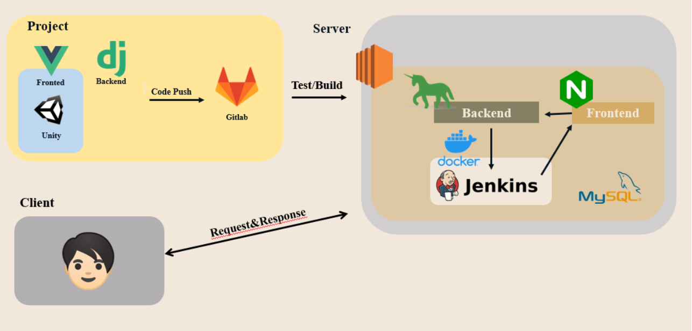 


<br>

## 향후 발전 가능성 및 의의 

- 현재 시장에 부족한 학습사이트를 직접 제공
- 프로그래밍에 관심을 가지는 청소년 및 청년 층에게 쉽고 재밌는 학습기회를 제공함
- 쉬운 난이도부터 어려운 난이도까지 다양한 난이도를 통해서 코딩테스트에 적응할 수 있는 역량을 기를 수 있음
- 유저들의 수요에 맞게 다양한 학습기능을 웹의 업로드하면서 전문 학습사이트 및 메타버스로 발전할 수 가능성이 있음

<br>


## 🕹 게임 스토리라인과 문제 배치 

##### 전체 틀

| STAGE     | Script                                                       | 등장 NPC                                                     | 문항                                                         |
| --------- | ------------------------------------------------------------ | ------------------------------------------------------------ | ------------------------------------------------------------ |
| 스테이지1 | - 토끼굴에 떨어진 앨리스<br />- 튜토리얼 문제와 마주한다.<br />- 튜토리얼 문제를 풀고 난 뒤 체셔 고양이를 만난다.<br />- 체셔고양이를 우측상단에 fixed 해 메뉴바나 도움말로 활용한다. | - 앨리스<br />- 토끼<br />- 체셔고양이                       | 약 2문항 <br />- SELECT<br />- CREATE                        |
| 스테이지2 | - 많은 문의 방에 도착한 앨리스<br />- 몸이 커지고 작아지는 물약들이 있다.<br />- 알맞은 물약을 찾아야하는 앨리스 | - 앨리스<br />- 체셔고양이<br />- 문 여러개<br />- 물약 여러개 | 약 10문항<br />- MIN, MAX, AVG, COUNT<br />- LIKE<br />- LIMIT, OFFSET, ORDER BY, WHERE<br />- INSERT, UPDATE, DELETE |
| 스테이지3 | - 다과회 장소에 도착한 앨리스<br />- 다과회에는 많은 종류의 디저트와 차가 있는데<br />- 그 중 궁합이 잘 맞는 디저트와 차를 매칭해야한다.<br />- 알러지가 있는 음식은 제외한다. | - 앨리스<br />- 토끼<br />- 모자장수                         | 약 8문항<br />- JOIN(INNER, LEFT, OUTER, CROSS)<br />- IF, CASE |
| 스테이지4 | - 카드병정이 모여있는 장소에 도착한 앨리스<br />- 카드병정을 모양별로 모은 후<br />- 숫자 순서대로 나열한다.<br />- 힌트를 얻은 후, 하트여왕에게 이동한다.<br />- 하얀 장미를 색칠해야 한다. | - 앨리스<br />- 카드병정<br />- 하트여왕                     | 약 4문항<br />- GROUP BY<br />- ORDER BY                     |

##### 실제 인게임

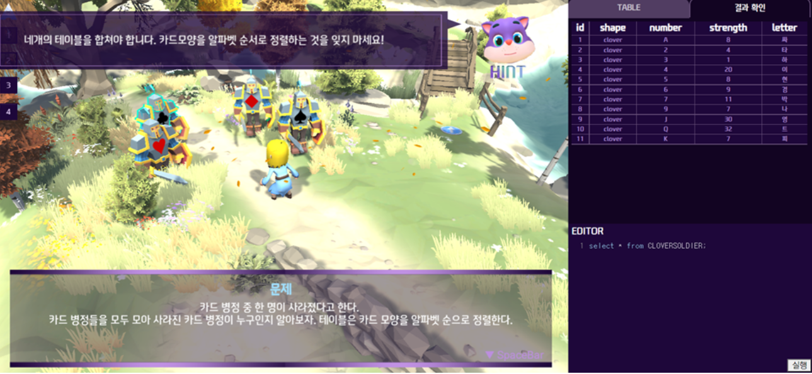


## 🎨 디자인

#### WEB페이지

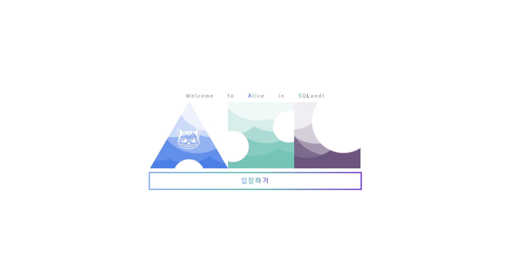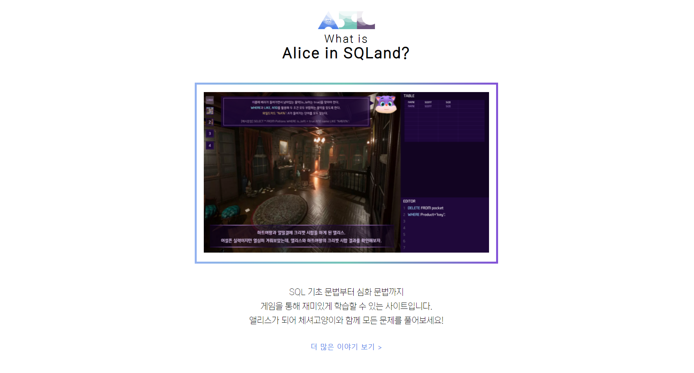


#### stage1(인게임|전경)

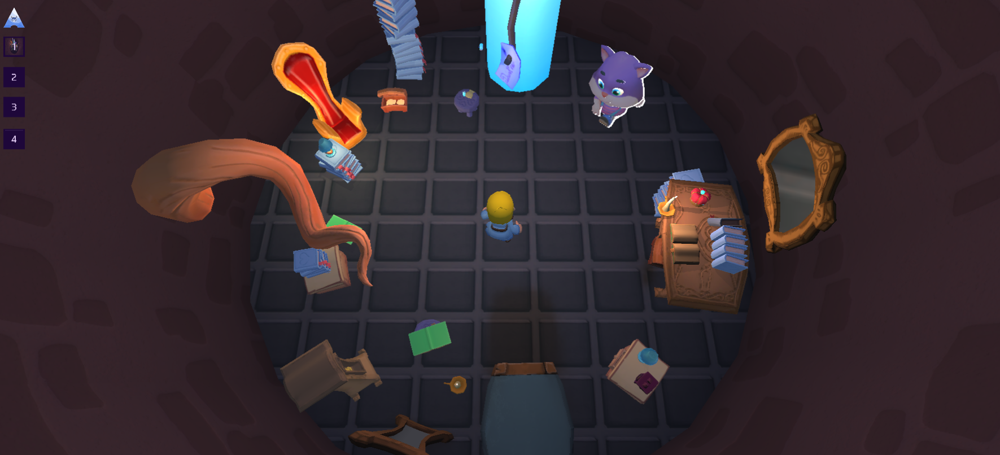

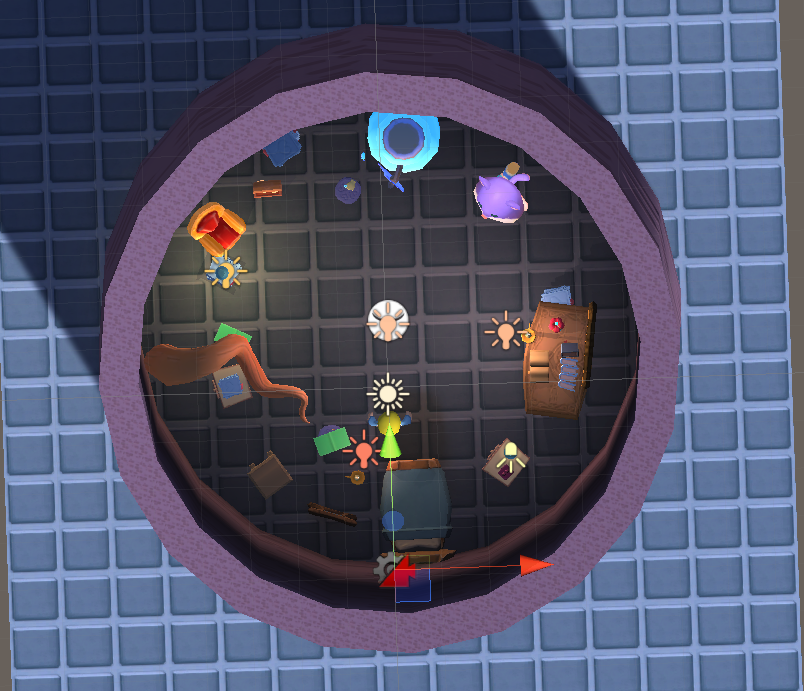

<br>

#### stage2(인게임|전경)

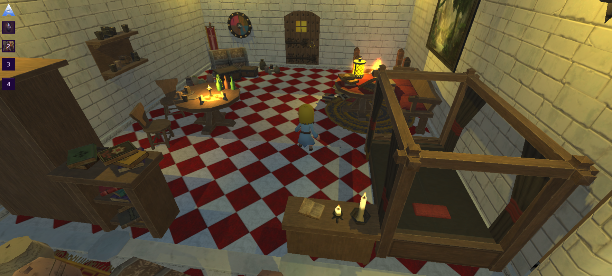

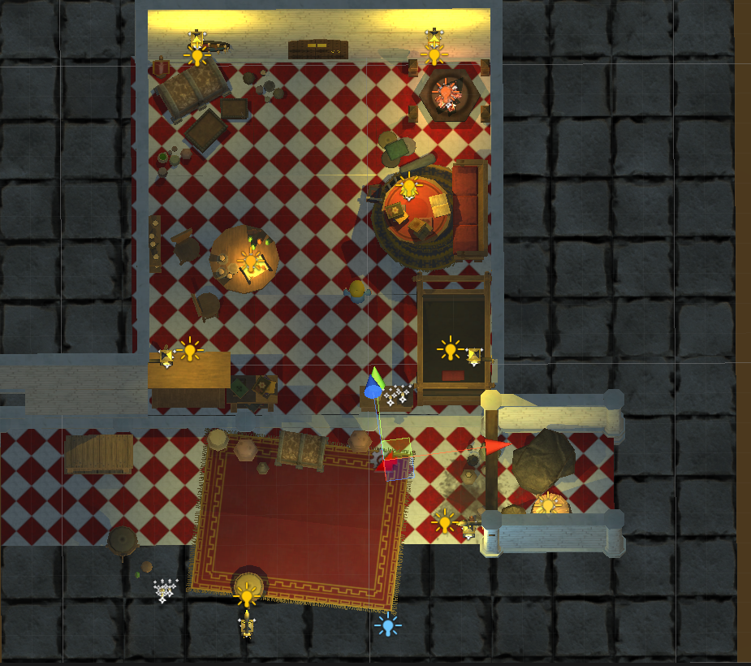

<br>

#### stage3(인게임|전경)

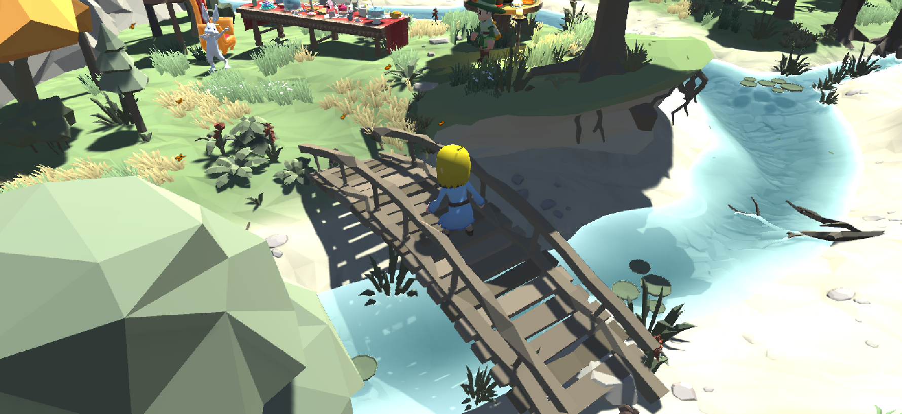

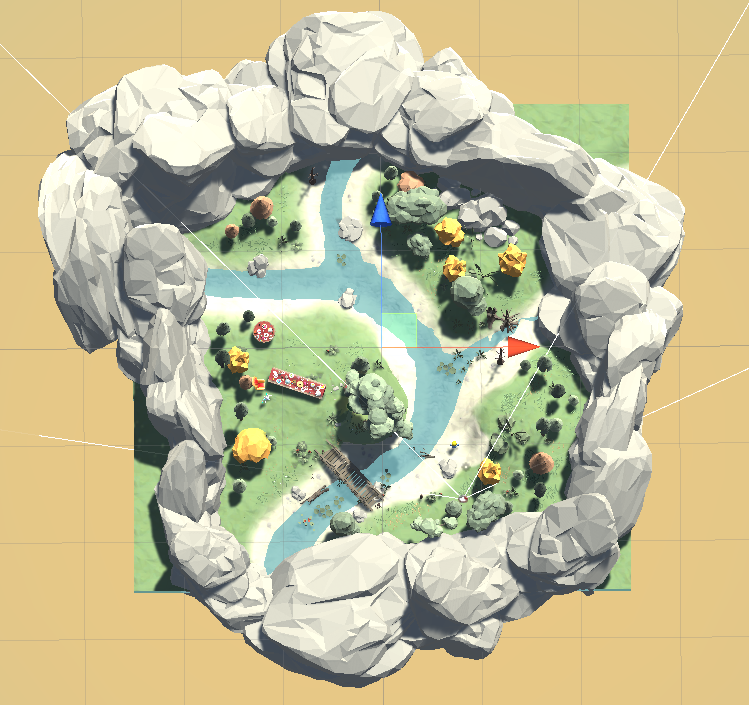

<br>

#### stage4(인게임|전경)

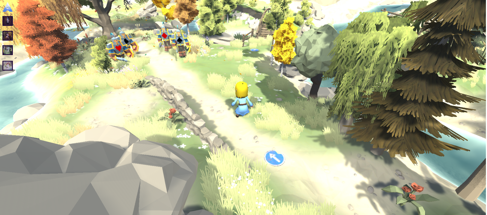

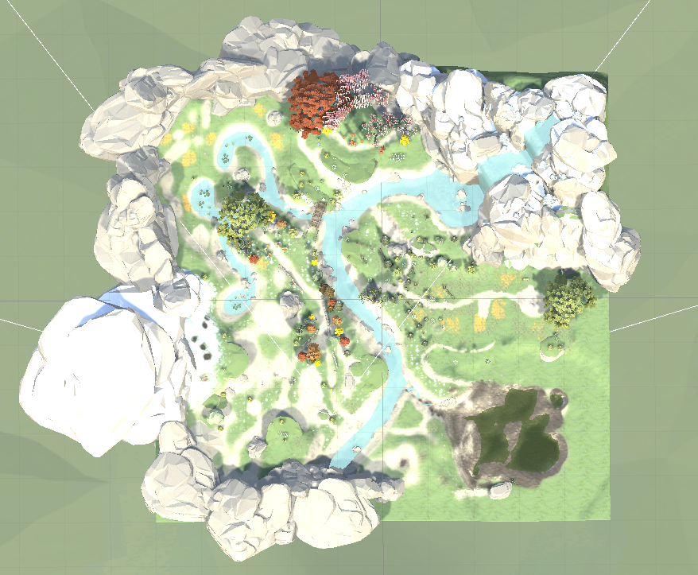

<br>

## 프로젝트 파일 구조

### Back

```
C:.
|   deploy.sh
|   front5.txt
|   manage.py
|   requirements.txt
|   
+---datacontroller
|   |   admin.py
|   |   apps.py
|   |   models.py
|   |   tests.py
|   |   urls.py
|   |   views.py
|   |   __init__.py
|   |   
|   \---migrations
|           __init__.py
|           
+---server
|       asgi.py
|       settings.py
|       urls.py
|       wsgi.py
|       __init__.py
|       
+---stage1
|   |   admin.py
|   |   apps.py
|   |   models.py
|   |   routers.py
|   |   serializers.py
|   |   tests.py
|   |   views.py
|   |   __init__.py
|   |   
|   +---fixture
|   |       room.json
|   |       
|   \---migrations
|           0001_initial.py
|           __init__.py
|           
+---stage2
|   |   admin.py
|   |   apps.py
|   |   models.py
|   |   routers.py
|   |   serializers.py
|   |   tests.py
|   |   views.py
|   |   __init__.py
|   |   
|   \---migrations
|           0001_initial.py
|           0002_remove_potion_name.py
|           __init__.py
|           
+---stage3
|   |   admin.py
|   |   apps.py
|   |   models.py
|   |   routers.py
|   |   serializers.py
|   |   tests.py
|   |   views.py
|   |   __init__.py
|   |   
|   \---migrations
|           0001_initial.py
|           0002_alter_neighbor_nap.py
|           __init__.py
|           
\---stage4
    |   admin.py
    |   apps.py
    |   models.py
    |   routers.py
    |   serializers.py
    |   tests.py
    |   views.py
    |   __init__.py
    |   
    \---migrations
            0001_initial.py
            0002_auto_20211111_1033.py
            0003_rose_roseinfo_scoreboard.py
            __init__.py
            
```

### Front

```
C:.
|   .gitignore
|   babel.config.js
|   package-lock.json
|   package.json
|   README.md
|   
+---public
|   |   favicon.ico
|   |   index.html
|   |   logo-small.png
|   |   unity-function.js
|   |   
|   \---unity
|       |   index.html
|       |   
|       +---Build
|       |       build.data.unityweb
|       |       build.json
|       |       build.wasm.code.unityweb
|       |       build.wasm.framework.unityweb
|       |       UnityLoader.js
|       |       
|       \---TemplateData
|               favicon.ico
|               fullscreen.png
|               progressEmpty.Dark.png
|               progressEmpty.Light.png
|               progressFull.Dark.png
|               progressFull.Light.png
|               progressLogo.Dark.png
|               progressLogo.Light.png
|               style.css
|               UnityProgress.js
|               webgl-logo.png
|               
\---src
    |   App.vue
    |   main.js
    |   
    +---assets
    |   |   certificate.png
    |   |   example.png
    |   |   logo-small.png
    |   |   logo.png
    |   |   
    |   \---answers
    |           answers.json
    |           
    +---components
    |       CodeEditor.vue
    |       codemirror.css
    |       ConfirmModal.vue
    |       Editor.vue
    |       Intro.vue
    |       ResultTable.vue
    |       Table.vue
    |       TableSet.vue
    |       WelcomeToASL.vue
    |       
    +---router
    |       index.js
    |       
    +---store
    |   |   index.js
    |   |   
    |   \---modules
    |           stages.js
    |           user.js
    |           websql.js
    |           
    +---utils
    |       event-bus.js
    |       
    \---views
            Complete.vue
            Game.vue
            Main.vue
            SetNickname.vue
            UnityGame.vue
```

### Unity(원본)

```
|   .collabignore
|   .vsconfig
|   Assembly-CSharp-Editor.csproj
|   Assembly-CSharp-firstpass.csproj
|   Assembly-CSharp.csproj
|   final_alice_1117.sln
|   
+---Assets
|       생략
+---Library
|       생략
+---Logs
|       Packages-Update.log
|       
+---obj
|   \---Debug
|       |   .NETFramework,Version=v4.7.1.AssemblyAttributes.cs
|       |   Assembly-CSharp-Editor.csproj.AssemblyReference.cache
|       |   Assembly-CSharp-firstpass.csproj.AssemblyReference.cache
|       |   Assembly-CSharp.csproj.AssemblyReference.cache
|       |   DesignTimeResolveAssemblyReferencesInput.cache
|       |   
|       \---TempPE
+---Packages
|       manifest.json
|       packages-lock.json
|       
\---ProjectSettings
        AudioManager.asset
        ClusterInputManager.asset
        DynamicsManager.asset
        EditorBuildSettings.asset
        EditorSettings.asset
        GraphicsSettings.asset
        InputManager.asset
        NavMeshAreas.asset
        PackageManagerSettings.asset
        Physics2DSettings.asset
        PresetManager.asset
        ProjectSettings.asset
        ProjectVersion.txt
        QualitySettings.asset
        TagManager.asset
        TimeManager.asset
        UnityConnectSettings.asset
        VFXManager.asset
        XRSettings.asset
        
```

